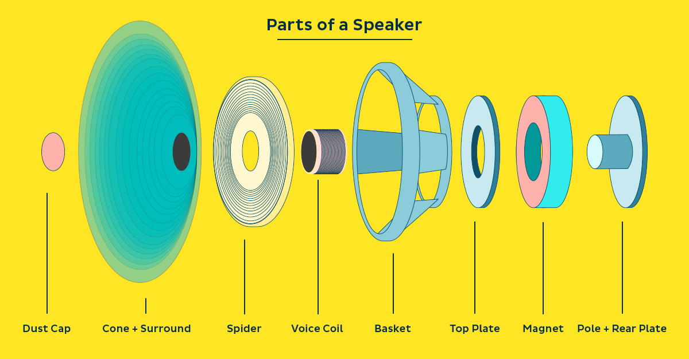

"Low Resistance" Curriculum
===========================

Table of Contents
=================

1. [Foreword](#foreword)
2. [Content](#content)
2. [Equipment](#equipment)
3. [Session One - Sound](#session-one---sound)
3. [Funding](#funding)

Foreword
========
The curriculum "<b>Low Resistance</b>" is a play-on-words.

The coil --- [ the long string of copper wire wrapped around in a circle ] --- 
The coil --- has some natural "<b>resistance</b>" to electricity flowing through it.

"<b>Low</b> resistance" suggests the curriculum is 
opposite 
highly inflexible, "<b>high</b> resistance" curriculum found in 
educational settings.

What are the motivations for this class? 
As I am older, it is obvious --- in trying to learn... <ins><b>anything</ins>:</b> 
having a **mentor** and without is like **day** and night.

Without a mentor, you must wander in the dark 
and use your <b>will</b> to find some <b>light</b>. 
You can move **faster** when 
someone is lifting you 
back to **running** after each fall.

When I remember back, the only mentors I had when I was young -- for a 
<ins>long period of time</ins> -- 
were my parents. I wonder how my life would have been different. 

**...again...** why? 
Before you are old -- is when tutors and mentors make the big differences. 
There are a few areas in which I can be a tutor or a mentor. 

Content
=======
The content for this class is based on pairing two ideas. 
I am betting that:

**sound** and **electrical "engineering"** concepts

pair together in such a way 
that they naturally increase understanding of the other.

Session One - Sound
-------------------
**Note:** I have planned material for a first "session".
 This may spill over into two or three days. 

<h3>Overview</h3>

1. What is sound?
   * Everyone give their defintion of sound.
2. Listen: various sound clips (nature, animals, instruments) 
   and view the sounds in **real-time**:
   * sound wave from oscilloscope
   * frequency graph from spectral analysis
      * use an equalizer ("EQ") to tune in and out certain sounds 
        with your own two hands 
        and watch them change on the two devices above
3. Play: various instruments, turntables, drum machine, analog synthesizers
4. Record: record some sounds from above
5. Listen: to our recordings, and additional sounds:
   * sound from drum machine, analog synthesizers
   * sound from a music recording -- and identify different instruments from the
     shape of the waveform
6. What is sound?
   * Everyone give their defintion of sound, again.
3. Play
4. Record
7. Listen
3. Introduction of each **path**
5. More playing, recording, and listening between every few introductions each paths

<h3>Paths</h3>

1. Neuroscience
   * An introduction to how the ear picks up vibrations in the air and
translates the vibrations into an electrical signal for the brain.
   * Everyone hears differently. Do a sound test to see who can hear the
     highest and lowest pitch sounds.
2. Physics
   * How does sound travel through the air (and what is the math that
     describes it)?
   * Does sound exist without air?
3. Amplifiers
   * An introduction in creating circuits that move speakers back and
     forth.
   * Build a basic amplifier circuit for a small speaker.
4. Speaker Boxes 
   * An introduction to creating a box that influences how speaker sounds.
   * Build a small speaker cabinet or 3D print a speaker enclosure.
5. Radio
   * An introduction to how electricity shoots off into the air.
   * Build an FM radio kit.
6. Recording
   * Learn how to properly capture sound.
7. Energy 
   * Build a solar panel and make it charge a car battery.
8. Electrical Engineering Theory
   * Double A batteries are 1.5 volts. What is a volt?
   * What does the math look like for describing how many electrons flow?
9. Turntables
   * Manipulate a record.
10. Drum Machine
    * The basics of how to create a drum loop.

Session Two
-
For the second session, there are a handful paths we can take. 
It is possible we explore more than one path at the same time. 
I have purposefully _not_ planned past session one because 
any plans would likely change.

Equipment
=

1. Oscilloscope: shows the shape of a sound wave
2. Spectral Analysis: shows the loudness of certain frequencies (or, "pitches")
3. Drum Machine: to create digital drum kits and patterns 
4. Turntables
5. Analog Synthesizers: electric circuits for creating sounds
5. Instruments: piano, guitar, drums, Native flute, uke, an electric keyboard
- misc: soldering iron, breaboards, electronic part library,
3D printer, table saw, skill saw, scrap wood, solar panel,
FM radio kits, amplifiers, subwoofer, mixers, microphone

Funding
=
If funding is available, it would be used towards:
* food: We will start off every day with food in the morning.
* supplies: I have most of the equipment already, but there are a few things which
            would help depending on the paths we take.
