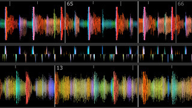
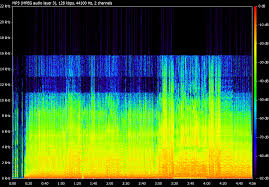
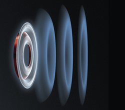
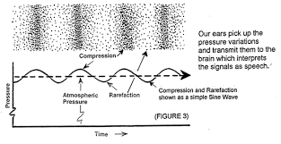

"Low Resistance" Curriculum
=

Table of Contents
=

1. [Summary](#summary)
1. [Content](#content)
2. [Equipment](#equipment)
3. [Pilot](#pilot)
4. [Assumptions](#assumptions)
1. [Afterthoughts](#afterthoughts)

Summary
=
This document describes 
the plans for a 2 month pilot of a 
project-based summer school 
for high school students.

Content
=
This content is primarily based on my own "educational background" 
and equipment that I have acquired over the years.

In this class, 
introductory college-level **electrical engineering** concepts 
are paired together with:
* **sound** (basic physics, brain interpretation)
* **music** (creation, recording, theory, history)
* **speakers, amplifiers** (construction, repair)
* **lighting** (additional parallels to frequency)

These concepts together are mutually beneficial.

Electrical engineering is an "abstract" concept because 
you have to hold it in your mind. 

It's unlike mechanical or civil engineering, 
where you can see with your eyes what is being built. 
The flow of electricity cannot be observed by the eye.

Pairing with these additional concepts 
provides a real-life parallel to 
something which is usually only thought of in the mind, 
and allows for it to be heard by the ear and seen by the eye, 
making it much easier to grasp.

Equipment
=

  
  

| Item | |
| ------------- | ------------- |
| Spectral Analyzer |  |
| Content Cell  | Content Cell  |

1. Oscilloscope: shows the shape of a sound wave
2. Spectral Analysis: shows the loudness of certain frequencies (or, "pitches")
3. Drum Machine: to create digital drum kits and patterns 
4. Turntables
5. Analog Synthesizers: electric circuits for creating sounds
5. Instruments: piano, guitar, drums, Native flute, uke, an electric keyboard
- misc: soldering iron, breaboards, electronic part library,
3D printer, table saw, skill saw, scrap wood, solar panel,
FM radio kits, amplifiers, subwoofer, mixers, microphone

Pilot
=

  
  

**Note:** I have planned material for a first "session".
 This may spill over into two or three days. 

Overview
-

1. What is sound?
   * Go around the circle and everyone give their defintion of sound.
2. Listen: sound clips (nature, animals, instruments) 
   and view the sounds in **real-time**:
   * sound wave from oscilloscope
   * frequency graph from spectral analysis
      * use an equalizer ("EQ") to tune in and out certain sounds 
        with your own two hands 
        and watch them change on the two devices above
3. Play
   * instruments, turntables, drum machine, analog synthesizers
4. Record
5. Listen to our recordings, and:
   * sound from the drum machine, analog synthesizers
   * sound from a song recording -- identify different instruments from the
     shape of the waveform
6. What is sound?
   * What is your definition of sound, now? 
1. What is music?
   * How do you define music?
3. Play
4. Record
7. Listen
3. Introduction of each **path**
5. More playing between introductions of paths

<h3>Paths</h3>

1. Neuroscience
   * How does the ear pick up vibrations in the air and then
translate these vibes into an electrical signal for the brain?
   * Everyone hears differently. Do a sound test to see who can hear the
     highest and lowest pitch sounds.
2. Physics
   * How does sound travel through the air (and what is the math that
     describes it)?
   * Does sound exist without air?
3. Amplifiers
   * How do you make a speaker cone vibrate?
4. Speaker Cabs 
   * How does a box influence how speaker a sounds?
   * Build one out of wood or design a model and 3D print it.
5. Radio
   * How does electricity shoot off into the air...?
   * Build an FM radio kit.
6. Recording
   * Learn how to capture sound.
7. Energy 
   * Build a solar panel and make it charge a car battery.
8. Electrical Engineering Theory
   * Double A batteries are 1.5 volts. What is a volt?
   * What does the math look like for describing how many electrons flow?
9. Turntables
   * Manipulate a record.
10. Drum Machine
    * Create a drum loop.

Session Two
-
For the second session, there are a handful paths we can take. 
It is possible we explore more than one path at the same time. 
I have purposefully _not_ planned past session one because 
any plans would likely change.

Assumptions
=

Afterthoughts
=
The curriculum "<b>Low Resistance</b>" is a play-on-words.

The coil of wire in a speaker --- [ a long string of copper wire wrapped around in a circle ] --- 
This coil --- has some natural "<b>resistance</b>" to electricity flowing through it.

"<b>Low</b> resistance" suggests the curriculum is 
opposite 
highly inflexible, "<b>high</b> resistance" curriculum found in 
educational settings.

--

What are the motivations for this class? 
As I grow older, it is obvious to me --- in trying to learn... <ins><b>anything</ins>:</b> 
having a **mentor** and without is like **day** and night.

Without a mentor, you must wander in the dark 
and use your <b>will</b> to find some <b>light</b>. 
You can move **faster** when 
someone is lifting you back up 
and helping you back to **running** after each fall.

When I remember back, the only mentors I had when I was young 
--- at least, for a <ins>long period</ins> of time --- 
were my parents. 
I wonder how my life may have been shaped.

--

**...again...** why bother with this class? 
Before you are old -- is when tutors and mentors make the big differences. 
There are a few areas in which I can be a tutor or a mentor. 

-- 

In a 4-year Bachelor's electrical engineering 
college curriculum, you are mostly taught theory.

Additionally, most of the theory (roughly... half) 
will **not** be used on a daily basis 
(unless you move into an advanced field).

Theory of one concept alone is obviously 
not a "well-rounded education".

At the end of it all, 
you have an good enough theoretical knowledge and 
little experience of how it applies to the real world, 
but you are ready to 
"join the workforce".

--

The result is an imbalance of knowledge.

Of the *teacher*: 
If the goal of an education is to enable the student to 
achieve anything the student desires, then 
it is not enough to "teach" about a specific technical field. 
The content chosen by the teacher is always changing over time 
and dependent on the students.

Of the *student*: 
If the goal of an education is to enable oneself to 
achieve your own dreams, then an education must 
cover a wide range of knowledge 
otherwise the scope of those dreams is to be limited .
